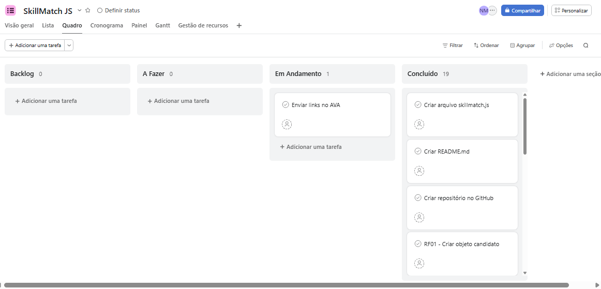
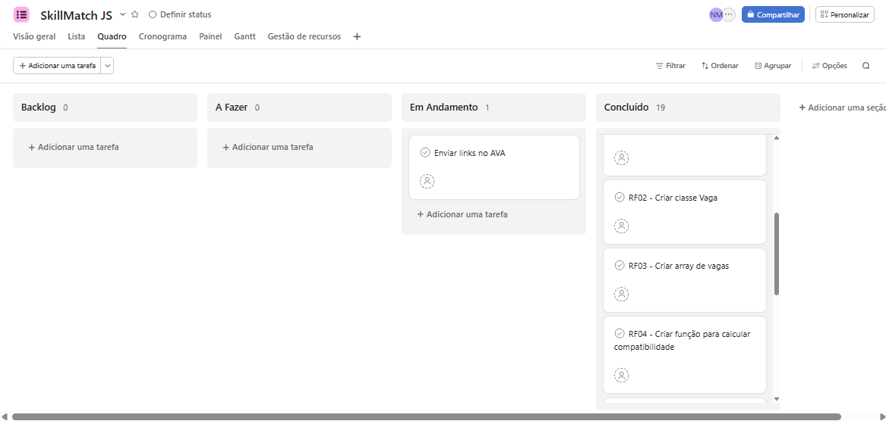
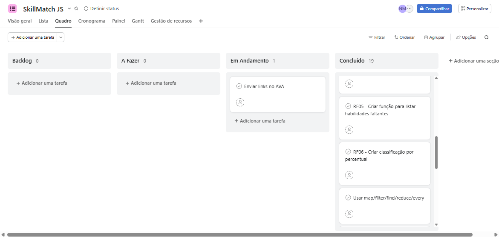
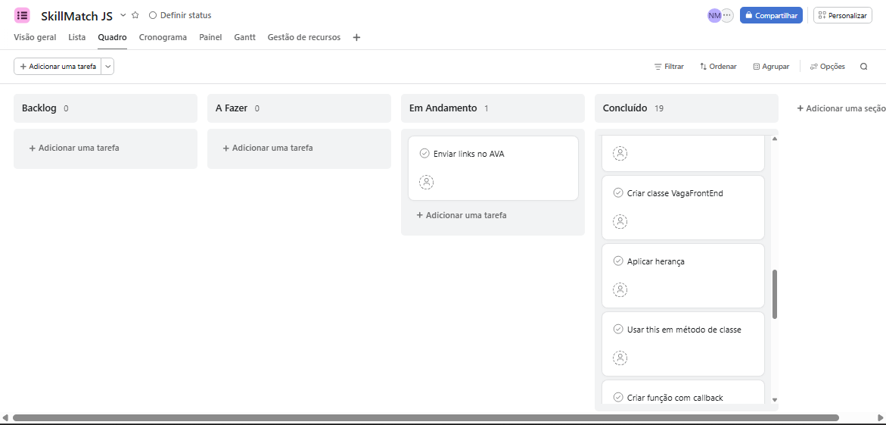
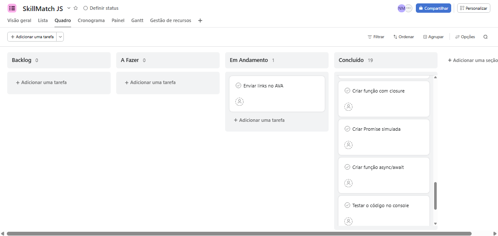
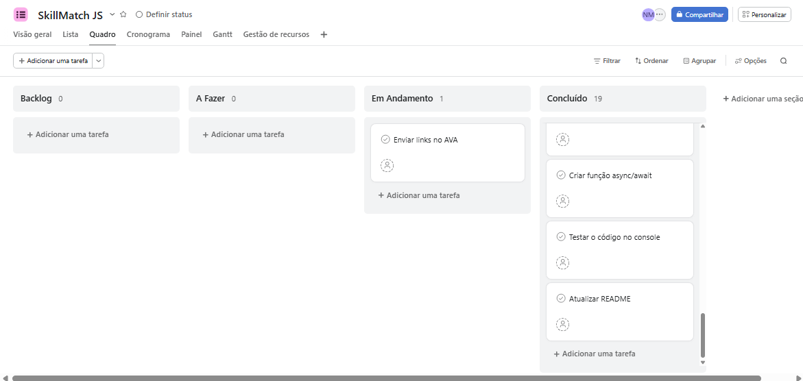

# SkillMatch JS

## Visão Geral do Sistema

O SkillMatch JS é uma aplicação desenvolvida em JavaScript voltada para a gestão de recrutamento técnico. O sistema atua cruzando o perfil profissional e o conjunto de competências de um candidato com as exigências específicas de oportunidades de emprego voltadas para o nível Front-End Júnior.

A partir desse processamento de dados, a inteligência do sistema analisa e retorna de forma automatizada:
* O nível percentual de equivalência técnica.
* Identificação das competências profissionais já dominadas.
* Diagnóstico das qualificações ausentes no perfil.
* Destaque da oportunidade com maior índice de aderência.
* Um plano direcionado com sugestões de conteúdos para especialização.

## Links do Projeto

* **Apresentação em Vídeo:** [https://drive.google.com/file/d/1p14R-1eC1Fjg8W2DQbk_9lJwj41pXNHv/view?usp=sharing]

* **Planejamento e Gestão de Tarefas (Asana):**
  







## Finalidade Acadêmica

Este projeto foi construído com o propósito prático de consolidar e demonstrar o domínio sobre os fundamentos estruturais e recursos avançados trabalhados ao longo do Módulo 01:
* Estruturação de lógica de programação e algoritmos.
* Tipagem de dados e manipulação de variáveis.
* Estruturas condicionais de tomada de decisão.
* Operadores lógicos, aritméticos e de comparação.
* Gerenciamento de escopo de variáveis.
* Laços de repetição e iterações de dados.
* Modularização por meio de funções e Arrow Functions.
* Estruturas de dados complexas: Arrays e Objetos.
* Programação Funcional utilizando métodos nativos de Array.
* Programação Orientada a Objetos: Classes, Herança e uso do `this`.
* Funções de alta ordem e inversão de controle com Callbacks.
* Encapsulamento de estado interno via Closures.
* Fluxos assíncronos e controle de tempo com Promises e Async/Await.
* Versionamento de código profissional com Git e GitHub.
* Organização ágil de fluxos de trabalho utilizando o modelo Kanban.

## Fundamentos de Tecnologia da Informação

### 1. Como a Internet Funciona
A internet é uma infraestrutura global composta por redes de computadores interconectadas que se comunicam através de um conjunto padronizado de regras conhecido como protocolo TCP/IP. Quando acessamos um endereço na web, as informações não viajam em um único bloco, mas são fragmentadas em pequenos pedaços chamados "pacotes de dados".

Esses pacotes são roteados de forma independente por cabos de fibra óptica, satélites e roteadores até chegarem ao destino final, onde são reagrupados para exibir o conteúdo original na tela. Todo esse ecossistema é traduzido para humanos através do DNS (Sistema de Nomes de Domínio), que converte nomes de sites (como `google.com`) nos endereços IP numéricos que os computadores utilizam para se localizar.

### 2. Arquitetura Cliente-Servidor
Trata-se de um modelo de computação distribuída que divide as tarefas entre dois componentes principais:
* **Cliente:** É a ponta que solicita recursos ou serviços (no nosso caso, o navegador web ou o terminal de execução).
* **Servidor:** É a máquina centralizada responsável por processar a requisição, gerenciar os dados e fornecer a resposta solicitada.

**Simulação de busca de dados no servidor:**

```javascript
function buscarVagasSimuladas() {
  return new Promise((resolve) => {
    setTimeout(() => {
      resolve(vagas);
    }, 1000);
  });
}
```

### 3. O Escopo de Variáveis e o uso do `var`
No JavaScript moderno, prioriza-se o uso de `let` e `const` devido ao controle rígido de escopo de bloco (delimitado por chaves `{}`). Historicamente, a linguagem utilizava a palavra-chave `var`.

A declaração com `var` possui escopo de função ou global. Isso significa que se uma variável for criada com `var` dentro de um bloco `if` ou `for`, ela "vaza" para fora do bloco e pode ser acessada ou modificada acidentalmente em outras partes do código. Além disso, o `var` sofre um efeito chamado *hoisting* (içamento), onde a variável é elevada ao topo do script antes da execução, permitindo que ela seja chamada antes mesmo de ser formalmente declarada, o que pode gerar comportamentos imprevisíveis e bugs no sistema.

## Instruções de Execução
Como este projeto executa de forma independente de ambientes de backend robustos, você pode rodá-lo diretamente pelo interpretador do próprio navegador:

1. Abra o navegador Google Chrome.
2. Acesse as ferramentas de desenvolvedor pressionando as teclas `F12` ou o atalho `Ctrl + Shift + J`.
3. Navegue até a aba **Console**.
4. Copie integralmente o código contido no arquivo `skillmatch.js`.
5. Cole o conteúdo copiado na área de digitação do console.
6. Pressione a tecla `Enter` para inicializar a simulação.

## Organização dos Arquivos
```txt
skillmatch-js/
│
├── skillmatch.js    # Código-fonte com a lógica e regras de compatibilidade
└── README.md        # Documentação técnica e conceitual do projeto